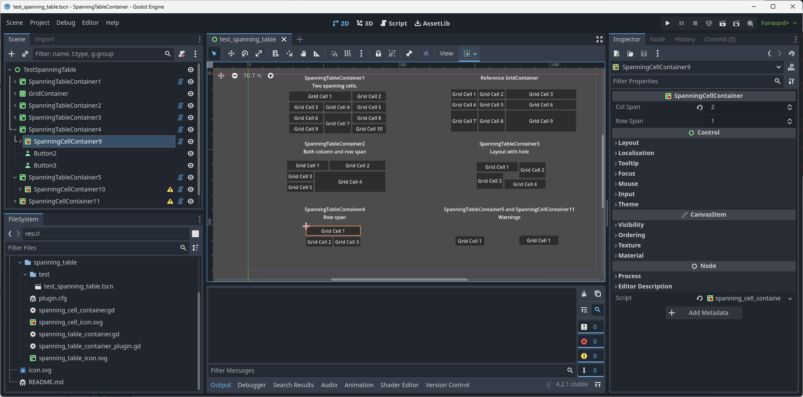

# SpanningTableContainer

The SpanningTableContainer plugin provide a table and a cell container 
that allow for GUI table with cells that span coloums and rows. The standard
GridContainer provide regular table of rows and columns. The SpanningTableContainer
use the SpanningCellContainer with the Col Span and Row Span attributes to define
cells that span over multiple columns and rows.

# How does it work?

1. Download the SpanningTableContainer plugin.
2. Enable the plugin in the project settings.
3. Add a SpanningTableContainer. Set the columns attribute.
4. Add normal gui controls to single cell entries.
5. Add SpanningCellContainer where a cell should span multiple columns and rows through setting the col_span and row_span attributes.

# Demonstration

Video below demonstrate the use of the SpanningTableContainer and SpanningCellContainer to create a table with spanning cells.

